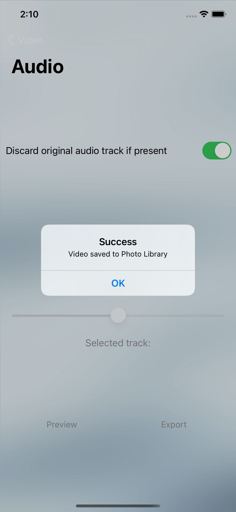

#  vidstrecher

## WORK IN PROGRESS

&nbsp;&nbsp;&nbsp;

vidstretcher is a utility to stetch a video duration to make it longer or shorter.
Ideal to create speedruns of timelapses with seconds constraints (eg posting to Instagram stories)
It currently strips the audio from the video, further development is planned to keep the audio track or add an external one

* Built in Swift and Storyboards using AutoLayout
* Shows usage of: AVKit and AVMutableVideoComposition
* No external libraries are used, the app works offline and no data is collected

